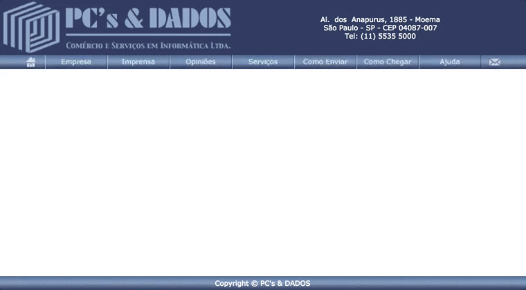

this is, to date, about 14 years later, my coding project I'm most proud of. done in 2003.

coincidentally, it is:

- still working
- the longest one running
- even helping to keep the business up
- and required almost no maintenance ever

### here's the most relevant part, after clicking [services] / [hire]:

instead of login and password, just enter your tax id.

we went with the idea that we only store publicly available data anyway. simplify.

time have spoken: over 10 years with no issues.

the other screens are just 2 regular forms, user data then the actual service order. finally one confirmation screen before submitting and one afterwards to say "thanks, we'll get in touch asap".

### and this is the control panel (not an usual thing back then):

basically it just list the OS'es, have a way to search through it all, a CRUD and print. many prints.

the whole team working on it was me and a web designer. using asp and access, so the company could manage the database themselves, and no javascript. back then client side scripts were not widespread and even considered bad as it would only function in a few places.

### all very ugly and outdated, isn't it?

not much more than the rest of the web, though. just for reference and fun:

