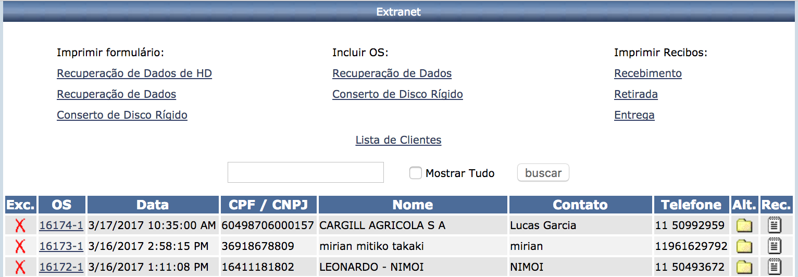
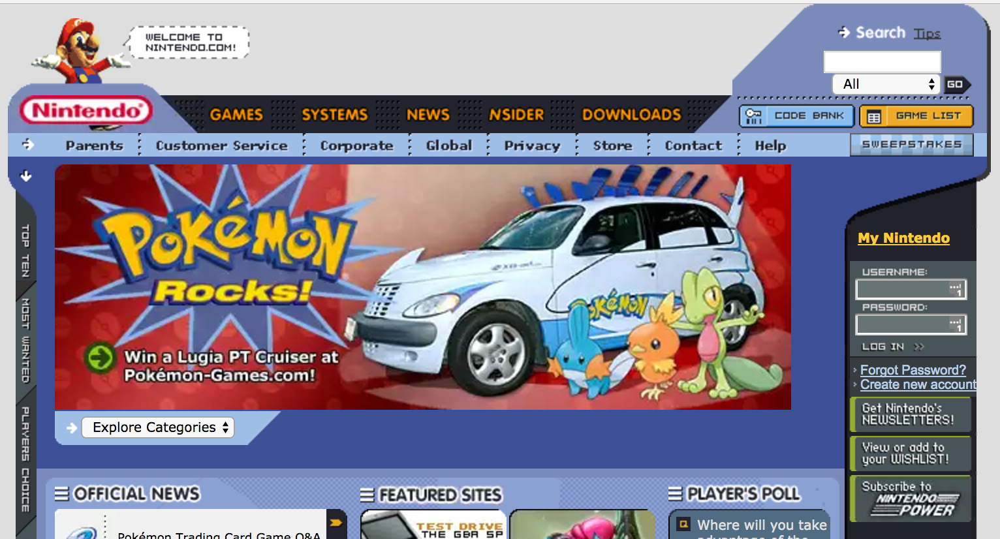
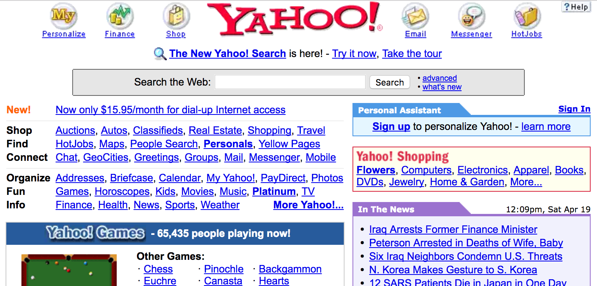
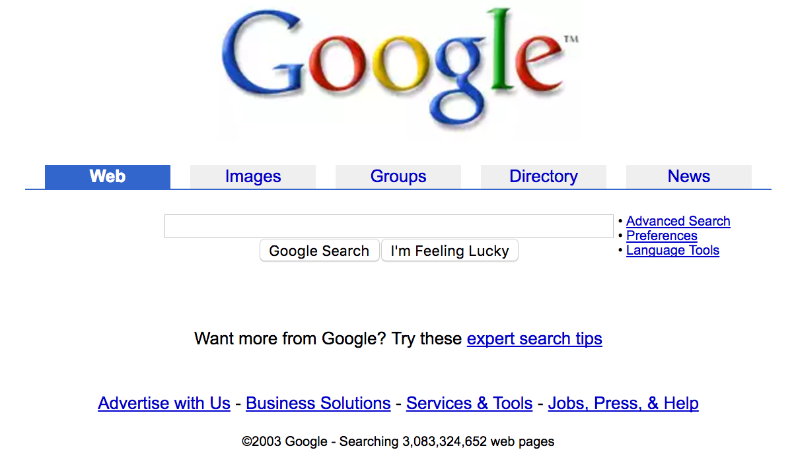

this is, to date, about 17 years later, my coding project I'm most proud of. done in 2003.

coincidentally, it's:

- still working
- the longest one running
- even helping to keep the business up
- and required almost no (technical) maintenance ever

### here's the most relevant part, after clicking [services] / [hire]:

*not so [proud](/proud) of the outdated code layout behind that ASP file, with over 30kb and 700 lines!*

instead of login and password, your "tax id" is all we need.

we went with the idea to store data which was, somehow, already publicly available (even if not by any simple means).

keep it simple. very little "privacy" in favor of much easier process.

time have spoken: over 10 years with no issues.

the other screens are 2 regular forms: user data then the actual service order. lastly one confirmation screen before submitting and one afterwards to say "thanks, we'll get in touch asap".

### and this is the control panel (not an usual thing back then):

<small>_granted, all the user the data outside the SO is publicly available but it's still a bit too sensitive to show it aggregated in this static page_</small>

basically it lists the OS'es, have a way to search through it all, a CRUD and print.

me and a web designer were the whole team working on it. using asp and access, so the company could manage the database themselves, and no javascript. back then client side scripts were not widespread and even considered bad as it would function solely in a couple unpopular browsers.

### ugly and outdated, isn't it?

not much more than the rest of the web, though. below there are some references from the same year. also for fun:

